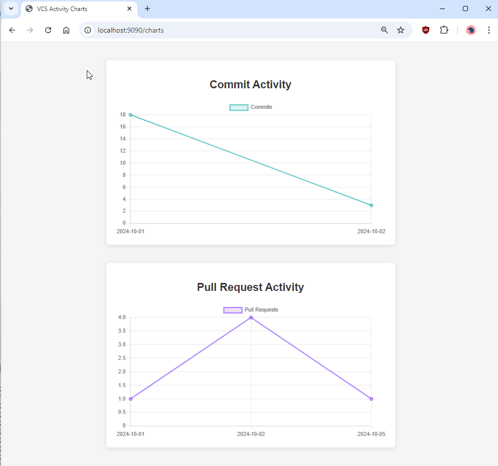
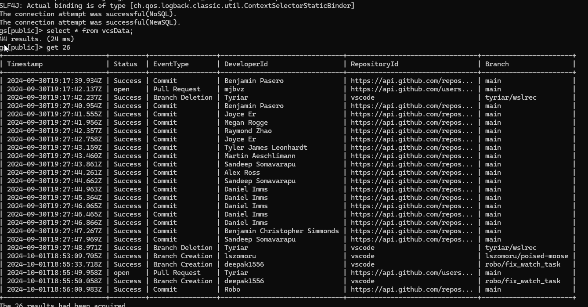

## **Introduction**

In today's competitive landscape, efficient software development is crucial for delivering high-quality products. A key factor in achieving this is monitoring developer activity in Version Control Systems (VCS) to optimize collaboration and code quality. By analyzing patterns in code commits, pull requests, merges, and branching, organizations can identify bottlenecks, improve workflows, and ultimately boost productivity.

Popular VCS tools such as Git, SVN, and GitLab allow teams to track changes, but analyzing large-scale development activities over time can be challenging. This is where GridDB, a high-performance time-series database, proves invaluable. Specifically designed to manage vast amounts of time-sensitive data, GridDB enables teams to efficiently capture, store, and analyze VCS events.

### **Why Use GridDB for VCS Activity Monitoring?**

**Time-Stamped Data Handling**  
Each commit, pull request, and merge event in a VCS is tied to a specific timestamp. GridDB is optimized for time-series data, making it ideal for capturing and analyzing time-sensitive developer activities.

**Scalability**  
In large, distributed teams, thousands of commits and pull requests may occur daily. GridDB’s scalable architecture ensures that even large volumes of VCS events can be ingested and queried efficiently, without performance degradation.

**Efficient Data Retrieval**  
GridDB allows time-based queries to quickly retrieve developer activities over specific periods (e.g., daily, weekly, monthly), providing real-time insights into team productivity and collaboration.

**Historical Insights**  
By analyzing past events—such as spikes in code conflicts or periods of low activity—teams can uncover patterns that lead to more efficient workflows. GridDB’s ability to store and query historical data facilitates in-depth analysis of development trends.

In this blog, we’ll explore how to monitor **Version Control System (VCS) Activity** using GridDB with a simple spring boot project. Specifically, we’ll track key development events such as:

- Code commits
- Pull requests
- Code merges

By storing and analyzing this data with GridDB, software teams, and project managers can:

- Monitor developer productivity by tracking code changes over time.
- Identify patterns such as merge conflicts or periods of high/low activity.
- Optimize collaboration by evaluating branching strategies and pull request workflows.
- Perform historical analysis to improve long-term development trends and practices.

## Setting Up GridDB Cluster and Spring Boot Integration: For Real-Time Monitoring

The first step is to set up a GridDB cluster and integrate it with our Spring Boot application as follows.

- **Setting up GridDB Cluster**

GridDB provides flexible options to meet different requirements. For development, a single-node cluster on our local machine may be sufficient. However, in production, distributed clusters across multiple machines are typically preferred for improved fault tolerance and scalability. For detailed guidance on setting up clusters based on our deployment strategy, refer to the GridDB documentation.

To set up a GridDB cluster, follow the steps mentioned [here](https://docs.griddb.net/gettingstarted/using-apt/#install-with-apt-get).

- **Setting up Spring Boot Application**

Once ourGridDB cluster is operational, the next step is connecting it to ourSpring Boot application. The GridDB Java Client API provides the necessary tools to establish this connection. To simplify the process, you can include the `griddb-spring-boot-starter` library as a dependency in our project, which offers pre-configured beans for a streamlined connection setup.

**Project Structure**

Here's a suggested project structure for such an application:

```shell
├───my-griddb-app
│   │   pom.xml
│   │   
│   ├───src
│   │   ├───main
│   │   │   ├───java
│   │   │   │   └───mycode
│   │   │   │       │   MySpringBootApplication.java
│   │   │   │       │
│   │   │   │       ├───config
│   │   │   │       │       GridDBConfig.java
│   │   │   │       │
│   │   │   │       ├───controller
│   │   │   │       │       ChartController.java
│   │   │   │       │
│   │   │   │       ├───dto
│   │   │   │       │       VcsActivityDTO.java
│   │   │   │       │
│   │   │   │       └───service
│   │   │   │               ChartService.java
│   │   │   │               MetricsCollectionService.java
│   │   │   │               RestTemplateConfig.java
│   │   │   │
│   │   │   └───resources
│   │   │       │   application.properties
│   │   │       │
│   │   │       └───templates
│   │   │               charts.html
```

This structure separates controllers, models, repositories, services, and the application entry point into distinct layers, enhancing modularity and maintainability. 

**Add GridDB Dependency**

To enable interaction with GridDB in our Spring Boot project, we must include the GridDB Java Client API dependency. This can be accomplished by adding the appropriate configuration to the project build file, such as `pom.xml` for Maven or the equivalent file for Gradle.

Here's an example of how to configure the dependency in the`pom.xml` file:

```xml
<project xmlns="http://maven.apache.org/POM/4.0.0"
  xmlns:xsi="http://www.w3.org/2001/XMLSchema-instance"
  xsi:schemaLocation="http://maven.apache.org/POM/4.0.0 http://maven.apache.org/maven-v4_0_0.xsd">
  <modelVersion>4.0.0</modelVersion>
  <groupId>com.example</groupId>
  <artifactId>my-griddb-app</artifactId>
  <version>1.0-SNAPSHOT</version>
  <name>my-griddb-app</name>
  <url>http://maven.apache.org</url>

  <parent>
    <groupId>org.springframework.boot</groupId>
    <artifactId>spring-boot-starter-parent</artifactId>
    <version>3.2.4</version>
    <relativePath /> <!-- lookup parent from repository -->
  </parent>

  <properties>
    <maven.compiler.source>17</maven.compiler.source>
    <maven.compiler.target>17</maven.compiler.target>
  </properties>

  <dependencies>
    <dependency>
      <groupId>org.springframework.boot</groupId>
      <artifactId>spring-boot-starter-actuator</artifactId>
    </dependency>
    <dependency>
      <groupId>junit</groupId>
      <artifactId>junit</artifactId>
      <version>3.8.1</version>
      <scope>test</scope>
    </dependency>
    <dependency>
      <groupId>com.github.griddb</groupId>
      <artifactId>gridstore</artifactId>
      <version>5.6.0</version>
    </dependency>
    <!-- Spring Boot dependencies -->
    <dependency>
      <groupId>org.springframework.boot</groupId>
      <artifactId>spring-boot-starter-web</artifactId>
      <exclusions>
        <exclusion>
          <groupId>org.springframework.boot</groupId>
          <artifactId>spring-boot-starter-logging</artifactId>
        </exclusion>
      </exclusions>
    </dependency>
    <dependency>
      <groupId>org.springframework.boot</groupId>
      <artifactId>spring-boot-starter-test</artifactId>
      <scope>test</scope>
    </dependency>
    <dependency>
      <groupId>org.springframework.boot</groupId>
      <artifactId>spring-boot-starter-thymeleaf</artifactId>
    </dependency>
    <!-- JSON processing -->
    <dependency>
      <groupId>com.fasterxml.jackson.core</groupId>
      <artifactId>jackson-databind</artifactId>
      <version>2.15.0</version> <!-- or the latest version -->
    </dependency>
    <!-- Lombok -->
    <dependency>
      <groupId>org.projectlombok</groupId>
      <artifactId>lombok</artifactId>
      <optional>true</optional>
    </dependency>
  </dependencies>
</project>
```

**Generate GitHub API Access Token**

To access GitHub data such as commits and pull requests, you'll need a **GitHub Personal Access Token**. Follow the instructions in the official GitHub documentation to create one:

1. Log in to GitHub.
2. Navigate to the [**GitHub Personal Access Token Documentation**](https://docs.github.com/en/enterprise-server@3.3/authentication/keeping-your-account-and-data-secure/creating-a-personal-access-token).
3. Follow the steps to generate a token with the necessary scopes (`repo`, `user`).


**Configure GridDB Connection**

After adding the GridDB dependency, the next step is configuring the connection details for our GridDB cluster in our Spring Boot application. This is usually configured in the `application.properties` file, where you can specify various settings for the application.

Here’s a quick example of how to set up those connection details:

```properties
GRIDDB_NOTIFICATION_MEMBER=127.0.0.1:10001
GRIDDB_CLUSTER_NAME=myCluster
GRIDDB_USER=admin
GRIDDB_PASSWORD=admin
management.endpoints.web.exposure.include=*
server.port=9090


# GitHub API token and configuration
github.api.token=github_DXXXXXXXXXXXXA5OyZwdXr
github.api.base-url=https://api.github.com
```

- `griddb.cluster.host`: The hostname or IP address of ourGridDB cluster.
- `griddb.cluster.port`: The port number on which the GridDB cluster is listening.
- `griddb.cluster.user`: The username for accessing the GridDB cluster.
- `griddb.cluster.password`: The password for the specified GridDB user (replace with ouractual password).
- `server.port=9090`: Sets the port on which ourSpring Boot application will run.
- `github.api.token`: The personal access token for authenticating with the GitHub API, as generated
- `github.api.base-url`: The base URL for making requests to the GitHub API (e.g., `https://api.github.com`).

**Create GridDB Client Bean**

To interact effectively with GridDB in our Spring Boot application,we need to create a dedicated Spring Bean to manage the GridDB connection. This bean will establish the connection using the parameters defined in the `application.properties` file and will act as the central interface for interacting with the GridDB cluster across the application.

Here's an example of how to define this bean in a Java class named `GridDbConfig.java`:

```java
package mycode.config;

import java.util.Properties;

import org.springframework.beans.factory.annotation.Value;
import org.springframework.context.annotation.Bean;
import org.springframework.context.annotation.Configuration;
import org.springframework.context.annotation.PropertySource;

import com.toshiba.mwcloud.gs.GSException;
import com.toshiba.mwcloud.gs.GridStore;
import com.toshiba.mwcloud.gs.GridStoreFactory;

@Configuration
@PropertySource("classpath:application.properties")
public class GridDBConfig {

 @Value("${GRIDDB_NOTIFICATION_MEMBER}")
  private String notificationMember;

 @Value("${GRIDDB_CLUSTER_NAME}")
  private String clusterName;

 @Value("${GRIDDB_USER}")
  private String user;

 @Value("${GRIDDB_PASSWORD}")
  private String password;

 @Bean
  public GridStore gridStore() throws GSException {
    // Acquiring a GridStore instance
    Properties properties = new Properties();
    properties.setProperty("notificationMember", notificationMember);
    properties.setProperty("clusterName", clusterName);
    properties.setProperty("user", user);
    properties.setProperty("password", password);
    return GridStoreFactory.getInstance().getGridStore(properties);
 }
}
```

## Metric Collection

Next, we will focus on collecting, transforming, and storing GitHub data for real-time VCS activity monitoring. The key metrics we'll be tracking include `commits`, `pull requests`, and other GitHub events that provide insights into developer productivity and project activity.

To collect the necessary data, we utilize specific API endpoints provided by GitHub. These endpoints allow us to track various development activities:

- **Commits**: Accessed via the endpoint `GET /repos/{owner}/{repo}/commits`, this provides a list of commits in a specified repository.

- **Pull Requests**: The endpoint `GET /repos/{owner}/{repo}/pulls` returns information on pull requests, including their current status.

- **Repository Events**: We can retrieve a comprehensive list of events using the endpoint `GET /repos/{owner}/{repo}/events`. This encompasses all significant actions within the repository.

**Loading Data into GridDB**

Once the required data is collected from GitHub, the next step is to load this information into GridDB for storage and further analysis. Here’s a high-level overview of the process:

Here’s a high-level overview of the process:

- **Authentication**: We begin by authenticating with GitHub’s API using an access token. This token ensures that our requests are authorized and can retrieve the necessary data. Therefore, we will set the header as follows for our API calls.

```java
  private HttpHeaders createHeaders() {
    HttpHeaders headers = new HttpHeaders();
    headers.set("Authorization", "Bearer " + githubApiToken);
    return headers;
 }
```

- **Data Transformation and Mapping**: After retrieval, the data will undergo transformation to align with the schema defined in GridDB. This step involves cleaning the data, filtering out irrelevant information, and mapping it to the appropriate fields within GridDB. Here is our `VcsActivityDTO `which is how our data will be stored in db.

```java
package mycode.dto;

import lombok.AllArgsConstructor;
import lombok.Data;
import lombok.NoArgsConstructor;
import java.util.Date;

import com.toshiba.mwcloud.gs.RowKey;

@Data
@NoArgsConstructor
@AllArgsConstructor
public class VcsActivityDTO {
 @RowKey
  public Date timestamp; // Time of the activity
  private String eventType; // Event type: commit, pull request, merge, branch
  private String developerId; // Developer who performed the activity
  private String repositoryId; // Repository ID or name
  private String branch; // Branch associated with the activity
  private String status; // Status (e.g., success, open, merged, conflict)
}
```

- **Data Ingestion**: Finally, the transformed data will be loaded into GridDB, where it can be accessed for real-time monitoring and analysis of developer activities.
  We will insert the data into our database as follows:

```java
   TimeSeries<VcsActivityDTO> ts = store.putTimeSeries("vcsData", VcsActivityDTO.class);
    for (VcsActivityDTO activity : result) {
          ts.append(activity);
 }
```

Below is the complete `MetricsCollectionService.java`, which implements all the aforementioned steps.

```java
package mycode.service;

import java.util.ArrayList;
import org.springframework.beans.factory.annotation.Autowired;
import org.springframework.beans.factory.annotation.Value;
import org.springframework.http.HttpEntity;
import org.springframework.http.HttpHeaders;
import org.springframework.http.HttpMethod;
import org.springframework.http.ResponseEntity;
import org.springframework.scheduling.annotation.Scheduled;
import org.springframework.stereotype.Service;
import org.springframework.web.client.RestTemplate;
import org.springframework.web.util.UriComponentsBuilder;

import com.fasterxml.jackson.core.JsonProcessingException;
import com.fasterxml.jackson.databind.JsonMappingException;
import com.toshiba.mwcloud.gs.*;
import mycode.dto.VcsActivityDTO;
import java.text.ParseException;
import java.text.SimpleDateFormat;
import java.util.List;
import java.util.Map;

@Service
public class MetricsCollectionService {
 @Autowired
  GridStore store;

 @Autowired
  RestTemplate restTemplate;

 @Value("${github.api.token}")
  private String githubApiToken;

 @Value("${github.api.base-url}")
  private String githubBaseUrl;

 @Scheduled(fixedRate = 2222260) // Collect metrics every minute
  public void collectMetrics() throws GSException, JsonMappingException, JsonProcessingException, ParseException {
    String repoOwner = "microsoft"; 
    String repoName = "vscode"; 

    List<VcsActivityDTO> commits = getCommits(repoOwner, repoName);
   List<VcsActivityDTO> pullRequests = getPullRequests(repoOwner, repoName);
    List<VcsActivityDTO> branchEvents = getBranchEvents(repoOwner, repoName);

   System.out.println("Collected Commits: " + commits.size());
   System.out.println("Collected Pull Requests: " + pullRequests.size());
    System.out.println("Collected Pull Requests: " + branchEvents.size());
    List<VcsActivityDTO> result = new ArrayList<>();
    result.addAll(commits);
    result.addAll(pullRequests);
    result.addAll(branchEvents);
    TimeSeries<VcsActivityDTO> ts = store.putTimeSeries("vcsData", VcsActivityDTO.class);
    for (VcsActivityDTO activity : result) {
        ts.append(activity);
 }
 }

  private HttpHeaders createHeaders() {
    HttpHeaders headers = new HttpHeaders();
    headers.set("Authorization", "Bearer " + githubApiToken);
    return headers;
 }

  // Method to retrieve commits from a specific repository
  public List<VcsActivityDTO> getCommits(String repoOwner, String repoName) throws ParseException {
    String url = UriComponentsBuilder.fromHttpUrl(githubBaseUrl)
 .path("/repos/{owner}/{repo}/commits")
 .buildAndExpand(repoOwner, repoName)
 .toUriString();

    HttpHeaders headers = createHeaders();
    HttpEntity<String> entity = new HttpEntity<>(headers);

    ResponseEntity<List> response = restTemplate.exchange(url, HttpMethod.GET, entity, List.class);
    List<VcsActivityDTO> commitActivities = new ArrayList<>();

    List<Map<String, Object>> commits = (List<Map<String, Object>>) response.getBody();
    if (commits != null) {
      for (Map<String, Object> commit : commits) {
        commitActivities.add(mapCommitToVcsActivityDTO(commit));
 }
 }

    return commitActivities;
 }

  public List<VcsActivityDTO> getPullRequests(String repoOwner, String repoName) throws ParseException {
    String url = UriComponentsBuilder.fromHttpUrl(githubBaseUrl)
 .path("/repos/{owner}/{repo}/pulls")
 .queryParam("state", "all") // Retrieves both open and closed pull requests
 .buildAndExpand(repoOwner, repoName)
 .toUriString();

    HttpHeaders headers = createHeaders();
    HttpEntity<String> entity = new HttpEntity<>(headers);

    ResponseEntity<List> response = restTemplate.exchange(url, HttpMethod.GET, entity, List.class);
    List<VcsActivityDTO> prActivities = new ArrayList<>();

    List<Map<String, Object>> pullRequests = (List<Map<String, Object>>) response.getBody();
    if (pullRequests != null) {
      for (Map<String, Object> pr : pullRequests) {
        prActivities.add(mapPullRequestToVcsActivityDTO(pr));
 }
 }

    return prActivities;
 }

  private VcsActivityDTO mapCommitToVcsActivityDTO(Map<String, Object> commitData) throws ParseException {
    Map<String, Object> commitInfo = (Map<String, Object>) commitData.get("commit");
    Map<String, Object> authorInfo = (Map<String, Object>) commitInfo.get("author");

    String eventType = "Commit";
    String developerId = (String) authorInfo.get("name");
    String repositoryId = (String) commitInfo.get("url"); 
    String branch = "main"; 
    String status = "Success";
    String timestamp = (String) authorInfo.get("date");

    return new VcsActivityDTO(new SimpleDateFormat("yyyy-MM-dd'T'HH:mm:ss'Z'").parse(timestamp), eventType, developerId, repositoryId, branch, status);
 }

  private VcsActivityDTO mapPullRequestToVcsActivityDTO(Map<String, Object> prData) throws ParseException {
    String eventType = "Pull Request";
    Map<String, Object> userInfo = (Map<String, Object>) prData.get("user");
    String developerId = (String) userInfo.get("login");
    String repositoryId = (String) userInfo.get("repos_url");; 
    String branch = (String) ((Map<String, Object>)prData.get("base")).get("ref"); 
    String status = (String) prData.get("state"); 
    String timestamp = (String) prData.get("created_at");
    return new VcsActivityDTO(new SimpleDateFormat("yyyy-MM-dd'T'HH:mm:ss'Z'").parse(timestamp), eventType, developerId, repositoryId, branch, status);
 }

  public List<VcsActivityDTO> getBranchEvents(String repoOwner, String repoName) throws ParseException{
    String url = UriComponentsBuilder.fromHttpUrl(githubBaseUrl)
 .path("/repos/{owner}/{repo}/events")
 .buildAndExpand(repoOwner, repoName)
 .toUriString();

    HttpHeaders headers = createHeaders();
    HttpEntity<String> entity = new HttpEntity<>(headers);

    ResponseEntity<List> response = restTemplate.exchange(url, HttpMethod.GET, entity, List.class);
    List<VcsActivityDTO> branchActivities = new ArrayList<>();

    List<Map<String, Object>> events = response.getBody();
    if (events != null) {
      for (Map<String, Object> eventData : events) {
        String eventType = (String) eventData.get("type");
        if ("CreateEvent".equals(eventType) || "DeleteEvent".equals(eventType)) {
          Map<String, Object> payload = (Map<String, Object>) eventData.get("payload");
          String refType = (String) payload.get("ref_type");
          if ("branch".equals(refType)) {
            String branchName = (String) payload.get("ref");
            String developerId = (String) ((Map<String, Object>)eventData.get("actor")).get("login");  
            String timestamp = (String) eventData.get("created_at");

            // Map to VcsActivityDTO
            VcsActivityDTO activity = new VcsActivityDTO(new SimpleDateFormat("yyyy-MM-dd'T'HH:mm:ss'Z'").parse(timestamp),
                eventType.equals("CreateEvent") ? "Branch Creation" : "Branch Deletion",
 developerId,
 repoName,
 branchName,
                "Success"
 );
            branchActivities.add(activity);
 }
 }
 }
 }
    return branchActivities;
 }

}
```

By following above steps, we can effectively extract data on developer activities from github, load it into GridDB.

## **Data Querying in GridDB and Visualization with Thymeleaf**

Once the data is stored and available in GridDB, the next step is to visualize this data in a way that provides actionable insights.

In this section, we’ll explore how to build a dashboard using Spring Boot, `Thymeleaf`, and `Chart.js` to render charts that display commits and pull request trends over time.

Here are the steps to achieve this:

- **Building the Chart Controller**

The `ChartController` acts as the intermediary between backend data in GridDB and the frontend visualizations displayed on the dashboard. Its responsibilities include handling HTTP requests, interacting with the service layer to fetch data, and passing that data to Thymeleaf templates for rendering.

Here’s how the `ChartController` is implemented:

```java
package mycode.controller;

import org.springframework.beans.factory.annotation.Autowired;
import org.springframework.stereotype.Controller;
import org.springframework.ui.Model;
import org.springframework.web.bind.annotation.GetMapping;

import com.fasterxml.jackson.databind.ObjectMapper;

import mycode.service.ChartService;
import mycode.dto.VcsActivityDTO;

import java.text.SimpleDateFormat;
import java.util.HashMap;
import java.util.List;
import java.util.Map;

@Controller
public class ChartController {

 @Autowired
  ChartService chartService;

 @Autowired
  private ObjectMapper objectMapper;

 @GetMapping("/charts")
  public String showCharts(Model model) {
    try {
      List<VcsActivityDTO> events = chartService.getVcsEvents();
      model.addAttribute("events", events);

      // Prepare data for charts
      Map<String, Integer> commitData = prepareCommitData(events);
      Map<String, Integer> prData = preparePullRequestData(events);

      // Convert Maps to JSON Strings for use in JavaScript in the Thymeleaf template
      String commitDataJson = objectMapper.writeValueAsString(commitData);
      String prDataJson = objectMapper.writeValueAsString(prData);

      model.addAttribute("commitDataJson", commitDataJson);
      model.addAttribute("prDataJson", prDataJson);

 } catch (Exception e) {
      e.printStackTrace();
 }
    return "charts";
 }

  private Map<String, Integer> prepareCommitData(List<VcsActivityDTO> events) {
    Map<String, Integer> commitMap = new HashMap<>();
    SimpleDateFormat dateFormat = new SimpleDateFormat("yyyy-MM-dd"); 

    for (VcsActivityDTO event : events) {
      if ("Commit".equals(event.getEventType())) {
        String timestamp = dateFormat.format(event.getTimestamp());
        commitMap.put(timestamp, commitMap.getOrDefault(timestamp, 0) + 1);
 }
 }
    return commitMap;
 }

  private Map<String, Integer> preparePullRequestData(List<VcsActivityDTO> events) {
    Map<String, Integer> prMap = new HashMap<>();
    SimpleDateFormat dateFormat = new SimpleDateFormat("yyyy-MM-dd"); // Date format

    for (VcsActivityDTO event : events) {
      if ("Pull Request".equals(event.getEventType())) {
        String timestamp = dateFormat.format(event.getTimestamp()); 
        prMap.put(timestamp, prMap.getOrDefault(timestamp, 0) + 1);
 }
 }
    return prMap;
 }
}
```

- **Implementing the Chart Service**

The `ChartService` acts as the business logic layer, encapsulating the operations needed to query GridDB and process the results. 

The `ChartService` class retrieves VCS (Version Control System) events from a GridStore database container called `"vcsData"`. The service processes each row of the result, mapping fields like `Timestamp`, `EventType`, `DeveloperId`, `RepositoryId`, `Branch`, and `Status` into a `VcsActivityDTO` object. Finally, it returns a list of these DTOs representing the VCS activity events.

Here’s how the `ChartService` is implemented:

```java
package mycode.service;

import java.text.SimpleDateFormat;
import java.util.ArrayList;
import java.util.Date;
import java.util.HashMap;
import java.util.Map;
import java.util.List;
import org.springframework.beans.factory.annotation.Autowired;
import org.springframework.stereotype.Service;

import com.toshiba.mwcloud.gs.Container;
import com.toshiba.mwcloud.gs.GridStore;
import com.toshiba.mwcloud.gs.Query;
import com.toshiba.mwcloud.gs.Row;
import com.toshiba.mwcloud.gs.RowSet;

import mycode.dto.VcsActivityDTO;

@Service
public class ChartService {

 @Autowired
  GridStore store;

  public List<VcsActivityDTO> getVcsEvents() throws Exception {

    Container<?, Row> container = store.getContainer("vcsData");
    if (container == null) {
      throw new Exception("Container not found.");
 }
    List<VcsActivityDTO> eventList = new ArrayList<>();


    SimpleDateFormat dateFormat = new SimpleDateFormat("yyyy-MM-dd'T'HH:mm:ss.SSS'Z'");
    Date now = new Date();

    String nowString = dateFormat.format(now);
    String startTime = "1971-12-23T18:18:52.000Z";

    String queryString = "select * where Timestamp >= TIMESTAMP('" + startTime
 + "') and Timestamp <= TIMESTAMP('" + nowString + "')";
    Query<Row> query = container.query(queryString);
    RowSet<Row> rs = query.fetch();

    while (rs.hasNext()) {
      Row row = rs.next();
      VcsActivityDTO event = new VcsActivityDTO();
      event.setTimestamp(row.getTimestamp(0));
      event.setEventType(row.getString(2));
      event.setDeveloperId(row.getString(3));
      event.setRepositoryId(row.getString(4));
      event.setBranch(row.getString(5));
      event.setStatus(row.getString(1));
      eventList.add(event);

 }
    return eventList;
 }

}
```

- **Rendering Charts with Thymeleaf**

With the data fetched and processed, the final step is to render the charts on the dashboard using Thymeleaf templates. Thymeleaf allows you to seamlessly integrate backend data into HTML views, making it a great choice for dynamic, data-driven applications.

Below is the implementation of `charts.html`:

```html
<!DOCTYPE html>
<html xmlns:th="http://www.thymeleaf.org">

<head>
  <title>VCS Activity Charts</title>
  <script src="https://cdn.jsdelivr.net/npm/chart.js"></script>
  <style>
    /* Center the content and add padding */
    body {
      font-family: Arial, sans-serif;
      display: flex;
      justify-content: center;
      align-items: center;
      flex-direction: column;
      margin: 0;
      padding: 20px;
      background-color: #f5f5f5;
 }

    /* Style containers for each chart */
    .chart-container {
      background-color: white;
      border-radius: 8px;
      box-shadow: 0 2px 10px rgba(0, 0, 0, 0.1);
      padding: 20px;
      margin: 20px 0;
      width: 100%;
      max-width: 600px;
 }

    /* Canvas styling with a fixed height */
    canvas {
      width: 100% !important;
      height: 300px !important;
 }

    /* Chart title styling */
    h2 {
      text-align: center;
      color: #333;
      font-size: 24px;
      margin-bottom: 20px;
 }
  </style>
</head>

<body>

  <div class="chart-container">
    <h2>Commit Activity</h2>
    <canvas id="commitChart"></canvas>
  </div>

  <div class="chart-container">
    <h2>Pull Request Activity</h2>
    <canvas id="prChart"></canvas>
  </div>

  <!-- Inline JavaScript block to properly process Thymeleaf variables -->
  <script th:inline="javascript">
    // Thymeleaf will automatically insert the JSON string correctly
    const commitData = [[${ commitDataJson }]];
    const prData = [[${ prDataJson }]];

    // Parse JSON data into JavaScript objects
    const parsedCommitData = JSON.parse(commitData);
    const parsedPrData = JSON.parse(prData);

    // Helper function to sort the data by date keys
    function sortByDate(data) {
      return Object.keys(data)
 .sort((a, b) => new Date(a) - new Date(b))  // Sort the date strings in ascending order
 .reduce((obj, key) => {
          obj[key] = data[key]; // Rebuild the object in sorted order
          return obj;
 }, {});
 }

    // Sort the commit and PR data by date
    const sortedCommitData = sortByDate(parsedCommitData);
    const sortedPrData = sortByDate(parsedPrData);

    // Extract labels (dates) and values (counts) for Commit chart
    const commitLabels = Object.keys(sortedCommitData);
    const commitValues = Object.values(sortedCommitData);

    // Extract labels (dates) and values (counts) for Pull Request chart
    const prLabels = Object.keys(sortedPrData);
    const prValues = Object.values(sortedPrData);

    // Commit Activity Chart
    const commitCtx = document.getElementById('commitChart').getContext('2d');
    const commitChart = new Chart(commitCtx, {
      type: 'line',
      data: {
        labels: commitLabels,
        datasets: [{
          label: 'Commits',
          data: commitValues,
          backgroundColor: 'rgba(75, 192, 192, 0.2)',
          borderColor: 'rgba(75, 192, 192, 1)',
          borderWidth: 2
 }]
 },
      options: {
        responsive: true,
        maintainAspectRatio: true,
        scales: {
          y: {
            beginAtZero: true
 }
 }
 }
 });

    // Pull Request Activity Chart
    const prCtx = document.getElementById('prChart').getContext('2d');
    const prChart = new Chart(prCtx, {
      type: 'line',
      data: {
        labels: prLabels,
        datasets: [{
          label: 'Pull Requests',
          data: prValues,
          backgroundColor: 'rgba(153, 102, 255, 0.2)',
          borderColor: 'rgba(153, 102, 255, 1)',
          borderWidth: 2
 }]
 },
      options: {
        responsive: true,
        maintainAspectRatio: true,
        scales: {
          y: {
            beginAtZero: true
 }
 }
 }
 });
  </script>
</body>

</html>
```

### Running the Project

To run the project, execute the following command to build and run our application:

```shell
mvn clean install && mvn spring-boot:run  
```

### Accessing the Dashboard

Once the application is up and running, open a web browser and navigate to `http://localhost:9090`. This URL will display our Thymeleaf-based dashboard, where we can view charts visualizing commit activity and pull request activity over time.



The charts on this dashboard is dynamically rendered using data retrieved from Github and processed by the application’s `ChartService`. 

**Data Storage in GridDB:**

The GridDB Shell tool allows for direct access and querying of data via the command line, as illustrated below.



### **Conclusion:**

Tracking VCS activity is critical for understanding team productivity and optimizing development workflows. By leveraging GridDB’s ability to handle time-series data efficiently, teams can capture key events like commits, merges, and pull requests with ease, allowing for both real-time insights and in-depth historical analysis.

With GridDB’s scalability and fast data retrieval, software teams can monitor trends, resolve bottlenecks, and improve collaboration, ultimately leading to more efficient and productive development processes.
